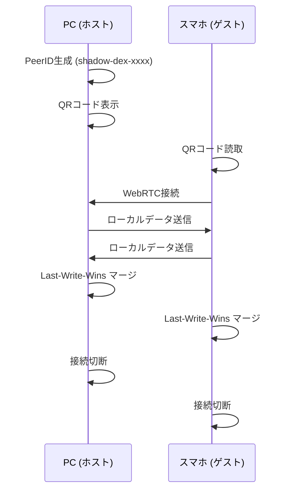

# Shadow Dex 設計書

## 1. プロジェクト概要

**Shadow Dex** は、ブラウザ上で完結するセキュアなローカル辞書・メモアプリケーションである。  
データは一切外部サーバーに送信されず、すべてブラウザのIndexedDBに保存される。  
PWA対応により、スマートフォン・PCのホーム画面にインストールしてネイティブアプリのように利用可能。

### 1.1 主要機能

| 機能 | 説明 |
|------|------|
| エントリ管理 | タイトル・カテゴリ・タグ・リッチテキストメモの作成・編集・削除 |
| リアルタイム検索 | タイトル・本文・タグを横断した即時絞り込み検索 |
| カテゴリ管理 | カテゴリの作成・編集・削除・ドラッグ＆ドロップ並び替え |
| P2Pデバイス同期 | QRコード＋WebRTCによるPC↔スマホ間のサーバーレス直接同期 |
| 暗号化バックアップ | AES暗号化ファイルによるエクスポート/インポート |
| PWA | オフライン対応、ホーム画面追加、Service Worker自動更新 |

---

## 2. 技術スタック

| カテゴリ | 技術 | バージョン |
|----------|------|-----------|
| フレームワーク | React | 19.2.0 |
| ビルドツール | Vite | 7.3.1 |
| 言語 | TypeScript | 5.9.3 |
| ローカルDB | Dexie (IndexedDB) | 4.3.0 |
| リッチテキストエディタ | BlockNote | 0.46.2 |
| P2P通信 | PeerJS (WebRTC) | 1.5.5 |
| QRコード生成 | qrcode.react | 4.2.0 |
| QRコード読取 | @yudiel/react-qr-scanner | 2.5.1 |
| 暗号化 | crypto-js (AES) | 4.2.0 |
| アイコン | lucide-react | 0.575.0 |
| PWA | vite-plugin-pwa | 1.2.0 |
| CSS | CSS Modules | - |
| デプロイ | Cloudflare Workers (Static Assets) | wrangler 4.67.0 |

---

## 3. ディレクトリ構成

```
shadow_dex/
├── public/
│   ├── pwa-192x192.png          # PWAアイコン (192x192)
│   ├── pwa-512x512.png          # PWAアイコン (512x512)
│   └── apple-touch-icon.png     # Apple Touch Icon
├── src/
│   ├── main.tsx                 # エントリーポイント（PWA SW登録）
│   ├── App.tsx                  # ルートコンポーネント（Storage Persistence要求）
│   ├── index.css                # グローバルCSS変数・テーマ定義
│   ├── App.css                  # Appコンポーネント固有スタイル
│   ├── db/
│   │   └── db.ts                # Dexie DBスキーマ・モデル定義
│   ├── sync/
│   │   └── syncManager.ts       # P2P同期ロジック (PeerJS)
│   └── components/
│       ├── Layout.tsx           # メインレイアウト・状態管理
│       ├── Sidebar.tsx          # サイドバー（カテゴリ一覧・ナビゲーション）
│       ├── SearchBar.tsx        # 検索バー
│       ├── EntryList.tsx        # エントリ一覧表示
│       ├── EntryEditor.tsx      # エントリ編集（BlockNoteエディタ）
│       ├── SettingsModal.tsx    # 設定・カテゴリ管理・バックアップ
│       ├── SyncModal.tsx        # デバイス同期UI
│       ├── HelpModal.tsx        # ヘルプ・使い方ガイド
│       ├── DynamicIcon.tsx      # Lucideアイコン動的レンダリング
│       └── *.module.css         # 各コンポーネント用CSSモジュール
├── index.html                   # HTMLテンプレート
├── vite.config.ts               # Vite設定（PWA・チャンク分割含む）
├── wrangler.jsonc               # Cloudflare Workers デプロイ設定
├── package.json                 # 依存関係・スクリプト定義
└── tsconfig.json                # TypeScript設定
```

---

## 4. データモデル（IndexedDB / Dexie）

DB名: `ShadowDexDB`（現行スキーマ: Version 3）

### 4.1 Entry テーブル

| フィールド | 型 | 説明 | インデックス |
|-----------|-----|------|-------------|
| `id` | `string` (UUID) | 主キー | ✅ PK |
| `title` | `string` | エントリタイトル | ✅ |
| `category` | `string` | 所属カテゴリ名 | ✅ |
| `tags` | `string[]` | タグ（複数） | ✅ MultiEntry |
| `content` | `string` | 本文（Markdown形式） | - |
| `createdAt` | `number` | 作成日時（Unix ms） | ✅ |
| `updatedAt` | `number` | 更新日時（Unix ms） | ✅ |

### 4.2 Category テーブル

| フィールド | 型 | 説明 | インデックス |
|-----------|-----|------|-------------|
| `id` | `string` (UUID) | 主キー | ✅ PK |
| `name` | `string` | カテゴリ名 | ✅ |
| `icon` | `string` | Lucideアイコン名 | ✅ |
| `color` | `string` | カテゴリカラー（hex） | - |
| `isDefault` | `boolean?` | デフォルトカテゴリフラグ | - |
| `sortOrder` | `number` | 表示順序 | ✅ |

### 4.3 デフォルトカテゴリ

初回DB作成時に以下の4カテゴリが自動生成される。

| ID | 名前 | アイコン | 色 |
|----|------|---------|-----|
| cat-1 | 人物メモ | User | #4F46E5 |
| cat-2 | 社内用語 | Book | #10B981 |
| cat-3 | ローカルルール | Hash | #F59E0B |
| cat-4 | その他 | Hash | #6B7280 |

### 4.4 DBマイグレーション履歴

| Version | 変更内容 |
|---------|---------|
| v1 | 初期スキーマ（entries, categories） |
| v2 | categories に `icon` フィールド追加。既存データには `Hash` をデフォルト設定 |
| v3 | categories に `sortOrder` フィールド追加。既存データには連番を自動設定 |

---

## 5. コンポーネントアーキテクチャ

### 5.1 コンポーネントツリー

```
App
└── Layout
    ├── Sidebar
    │   └── DynamicIcon
    ├── SearchBar
    ├── EntryList
    ├── EntryEditor (モーダル)
    │   └── BlockNote Editor
    ├── SettingsModal (モーダル)
    │   └── DynamicIcon
    ├── SyncModal (モーダル)
    │   ├── QRCodeSVG
    │   └── Scanner
    └── HelpModal (モーダル)
```

### 5.2 各コンポーネントの責務

#### App (`App.tsx`)
- ルートコンポーネント
- アプリ起動時に `navigator.storage.persist()` を呼び出し、ストレージ永続化を要求

#### Layout (`Layout.tsx`)
- アプリ全体のレイアウト管理（サイドバー + メインエリア）
- 全モーダルの開閉状態を管理
- 検索クエリ・カテゴリフィルタの状態を管理
- `open-entry` カスタムイベントのリスナー

#### Sidebar (`Sidebar.tsx`)
- カテゴリ一覧表示（`sortOrder` 昇順）
- ドラッグ＆ドロップによるカテゴリ並び替え（HTML5 Drag and Drop API）
- カテゴリフィルタの選択
- ナビゲーション（新規作成、同期、設定、ヘルプへのショートカット）
- モバイル時はスライドイン表示

#### SearchBar (`SearchBar.tsx`)
- テキスト入力による検索クエリの送信

#### EntryList (`EntryList.tsx`)
- エントリ一覧表示（`updatedAt` 降順ソート）
- カテゴリフィルタ・検索クエリによるリアルタイムフィルタリング（`useMemo`で最適化）
- コンテンツプレビュー表示（Markdownタグ除去、150文字に切り詰め）

#### EntryEditor (`EntryEditor.tsx`)
- エントリの新規作成・編集・削除
- BlockNoteリッチテキストエディタによるコンテンツ編集
- カテゴリ選択・タグ入力
- エントリリンク候補のサジェスト機能（`@` メンション）
- 表示/編集モード切り替え

#### SettingsModal (`SettingsModal.tsx`)
- **データ管理タブ**: ストレージ保護状態の表示、暗号化バックアップ / 復元
- **カテゴリ設定タブ**: カテゴリのCRUD操作、プリセットアイコン選択

#### SyncModal (`SyncModal.tsx`)
- **ホストモード（PC側）**: PeerID生成 → QRコード表示 → 接続待ち
- **ゲストモード（スマホ側）**: カメラでQRコード読取 → ホストに接続
- 同期状態の表示（生成中→待機→接続中→同期中→成功/エラー）

#### HelpModal (`HelpModal.tsx`)
- アプリの主要機能紹介
- 使い方ガイド（4ステップ）

#### DynamicIcon (`DynamicIcon.tsx`)
- Lucideアイコンを文字列名から動的にレンダリングするユーティリティコンポーネント

---

## 6. P2P同期アーキテクチャ

### 6.1 概要

サーバーを介さないWebRTC（PeerJS）ベースのP2P直接同期。  
PC↔スマホ間でQRコードを用いたPeerID交換を行い、双方のデータをマージする。

### 6.2 同期フロー



### 6.3 マージ戦略

**Last-Write-Wins (LWW)** 方式を採用。

1. リモートから受信した各エントリについて:
   - ローカルに同一IDが存在しない → **追加**
   - ローカルに同一IDが存在し、リモートの `updatedAt` が新しい → **上書き**
   - ローカルに同一IDが存在し、ローカルの `updatedAt` が新しい → **保持**

---

## 7. バックアップ・復元

### 7.1 エクスポート

1. 全 `entries` + `categories` をJSON化
2. ユーザー入力のパスワードで **AES暗号化**（CryptoJS）
3. `.enc` ファイルとしてダウンロード

### 7.2 インポート

1. `.enc` ファイルを読み込み
2. パスワードでAES復号化
3. 確認ダイアログ後、現在のデータを全置換

---

## 8. PWA設定

### 8.1 Service Worker

- `vite-plugin-pwa` による `generateSW` モード
- `autoUpdate` 登録タイプ（新バージョン検知時にユーザー確認でリロード）
- キャッシュサイズ上限: 5MB（BlockNoteチャンク対応）

### 8.2 Manifest

| 項目 | 値 |
|------|-----|
| name | Shadow Dex |
| short_name | ShadowDex |
| display | standalone |
| theme_color | #000000 |
| background_color | #ffffff |

### 8.3 アイコン

| ファイル | サイズ | 用途 |
|---------|--------|------|
| `pwa-192x192.png` | 192x192 | 標準PWAアイコン |
| `pwa-512x512.png` | 512x512 | Maskable / スプラッシュ |
| `apple-touch-icon.png` | - | iOS Safari ホーム画面 |

---

## 9. ビルド・デプロイ

### 9.1 ビルド構成

- **チャンク分割戦略** (`manualChunks`):
  - `blocknote`: `@blocknote/core`, `@blocknote/react`, `@blocknote/mantine`
  - `vendor`: `react`, `react-dom`, `dexie`, `dexie-react-hooks`

### 9.2 デプロイ構成

| 項目 | 値 |
|------|-----|
| プラットフォーム | Cloudflare Workers (Static Assets) |
| 設定ファイル | `wrangler.jsonc` |
| ビルドコマンド | `npm run build` |
| デプロイコマンド | `npx wrangler deploy` |
| 出力ディレクトリ | `./dist` |

### 9.3 スクリプト一覧

| コマンド | 説明 |
|---------|------|
| `npm run dev` | 開発サーバー起動（HTTPS / LAN公開） |
| `npm run build` | TypeScriptチェック + Viteプロダクションビルド |
| `npm run lint` | ESLint実行 |
| `npm run preview` | ビルド済みファイルのプレビューサーバー |
| `npm run deploy` | ビルド + Cloudflare Pagesデプロイ |

---

## 10. セキュリティ設計

| レイヤー | 対策 |
|---------|------|
| データ保存 | ブラウザ内IndexedDB（外部送信なし） |
| バックアップ | AES暗号化ファイル（パスワード保護） |
| P2P通信 | WebRTC DTLS暗号化（PeerJS経由） |
| ストレージ保護 | `navigator.storage.persist()` によるブラウザ削除防止要求 |
| 入力サニタイズ | BlockNote + rehype-sanitize によるXSS対策 |
